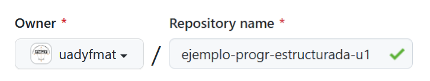
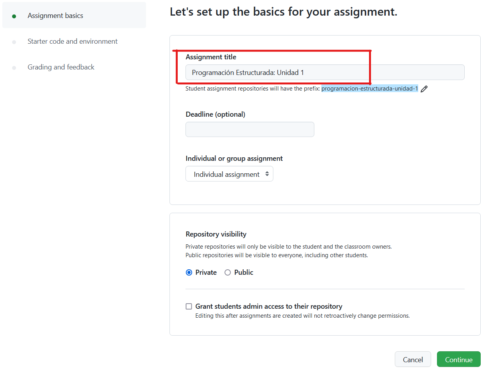
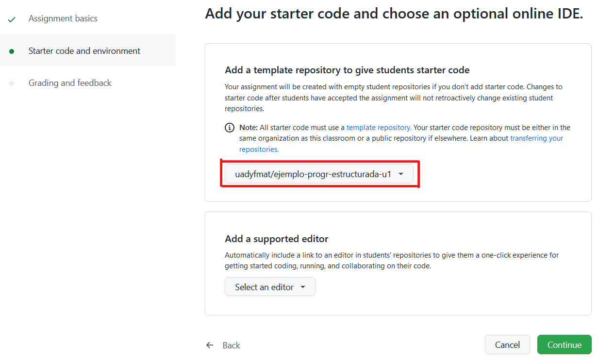
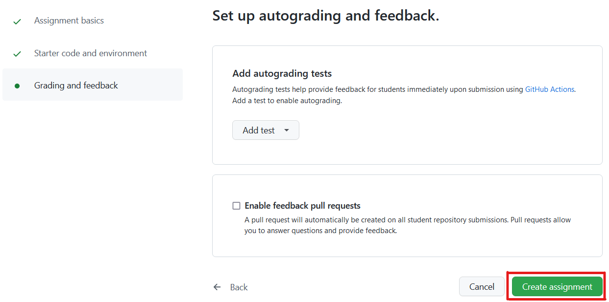
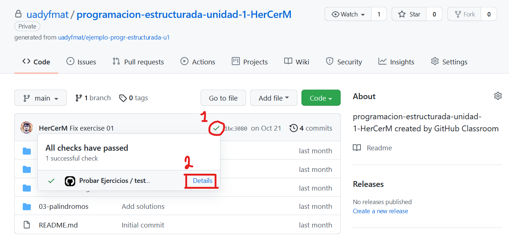
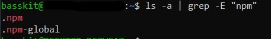
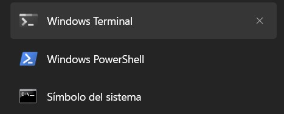

# Test Runner: Auto-evaluación con GitHub

[Test Runner](https://github.com/uadyfmat/test-runner) funciona en directorios con una estructura particular, donde cada uno de estos directorios representa un ejercicio de programación.

Para conseguir un **mecanismo de auto-evaluación**, se pretende que estos ejercicios se agrupen en repositorios de GitHub con un workflow de GitHub Actions ya configurado. Cada repositorio contiene varios ejercicios.

Aquí se describe lo que los alumnos, profesores y desarrolladores necesitan saber acerca de Test Runner respecto a los repositorios de ejercicios.

🗺 Índice de contenidos:

- [Documentación para **alumnos**](#para-alumnos)
- [Documentación para **profesores**](#para-profesores)
- [Documentación para **desarrolladores**](#para-desarrolladores)
- [Problemas frecuentes](#problemas)

## <a name="para-alumnos">Para alumnos</a> [&#8593;](#test-runner-auto-evaluación-con-github)

Para resolver los ejercicios de programación y poder obtener retroalimentación acerca de las soluciones, se require:

1. Instalar Test Runner y el software del que depende.
2. Usar Test Runner para probar las soluciones localmente.
3. Ver en GitHub la auto-evaluación del repositorio.

🎥 Puede referirse a una **[explicación en video](https://youtu.be/YV7xHDyxMRs)** donde se abarcan los pasos, o alternativamente a continuación se describe cada paso.

### 1. Instalación de Test Runner

Antes de utilizar Test Runner, es necesario realizar lo siguiente:

1. [Instala el software necesario para Test Runner](https://github.com/uadyfmat/test-runner#installation-and-usage).
2. [Instala los comandos necesarios para tu lenguaje de preferencia](https://github.com/uadyfmat/test-runner#supported-languages).
3. [Verifica que tu shell y terminal sean adecuados](https://github.com/uadyfmat/test-runner#shells-and-terminals).

**Acerca del punto 3 en Windows:** Teniendo Git Bash ya instalado, poder usarlo en Windows Terminal consiste en modificar un archivo de configuración:

1. Abre Windows Terminal.
2. Abre el archivo de configuración `settings.json`. Para conseguir esto, presiona <kbd>Ctrl+,</kbd>, luego en la barra lateral de la izquierda hasta abajo presiona el botón de abrir el archivo JSON.
3. En la propiedad `"list"` dentro de `"profiles"`, agrega el siguiente objeto como primer elemento del arreglo:

```text
{
    "commandline": "%PROGRAMFILES%/git/usr/bin/bash.exe -i -l",
    "guid": "{00000000-0000-0000-ba54-000000000002}",
    "icon": "%PROGRAMFILES%/Git/mingw64/share/git/git-for-windows.ico",
    "name": "Git Bash",
    "startingDirectory": "%USERPROFILE%"
}
```

Es posible que sea necesario modificar la ruta en `"commandline"` y `"icon"`, en caso que no se encuentren ahí el ejecutable o el ícono, aunque por defecto ahí se deberían encontrar.

<details>
<summary>Ejemplo de un <code>settings.json</code> completo.</summary>

```json
{
  "$schema": "https://aka.ms/terminal-profiles-schema",
  "actions": [
    {
      "command": {
        "action": "copy",
        "singleLine": false
      },
      "keys": "ctrl+c"
    },
    {
      "command": "paste",
      "keys": "ctrl+v"
    },
    {
      "command": "find",
      "keys": "ctrl+shift+f"
    },
    {
      "command": {
        "action": "splitPane",
        "split": "auto",
        "splitMode": "duplicate"
      },
      "keys": "alt+shift+d"
    }
  ],
  "copyFormatting": "none",
  "copyOnSelect": false,
  "defaultProfile": "{00000000-0000-0000-ba54-000000000002}",
  "profiles": {
    "defaults": {
      "closeOnExit": "always",
      "colorScheme": "deep",
      "fontFace": "Consolas"
    },
    "list": [
      {
        "commandline": "%PROGRAMFILES%/git/usr/bin/bash.exe -i -l",
        "guid": "{00000000-0000-0000-ba54-000000000002}",
        "icon": "%PROGRAMFILES%/Git/mingw64/share/git/git-for-windows.ico",
        "name": "Git Bash",
        "startingDirectory": "%USERPROFILE%"
      },
      {
        "commandline": "cmd.exe",
        "guid": "{0caa0dad-35be-5f56-a8ff-afceeeaa6101}",
        "hidden": false,
        "name": "S\u00edmbolo del sistema"
      },
      {
        "commandline": "powershell.exe",
        "guid": "{61c54bbd-c2c6-5271-96e7-009a87ff44bf}",
        "hidden": false,
        "name": "Windows PowerShell"
      }
    ]
  },
  "schemes": [
    {
      "background": "#090909",
      "black": "#000000",
      "blue": "#5665FF",
      "brightBlack": "#535353",
      "brightBlue": "#9FA9FF",
      "brightCyan": "#8DF9FF",
      "brightGreen": "#22FF18",
      "brightPurple": "#E09AFF",
      "brightRed": "#FB0007",
      "brightWhite": "#FFFFFF",
      "brightYellow": "#FEDC2B",
      "cursorColor": "#D0D0D0",
      "cyan": "#50D2DA",
      "foreground": "#CDCDCD",
      "green": "#1CD915",
      "name": "deep",
      "purple": "#B052DA",
      "red": "#D70005",
      "selectionBackground": "#D2D2D2",
      "white": "#E0E0E0",
      "yellow": "#D9BD26"
    }
  ],
  "theme": "dark"
}
```

</details>

Una vez analizado el Json con la configuración anterior les recomendamos analizar la linea `defaultProfile` debido a que esta tiene que considir con el gui que acaban de agregar del `git bash` para que al momento de abrir windows terminal este pueda abrir en primera instancia este, para que asi puedan utilizar los comando correspondientes.

### 2. Uso de Test Runner

Teniendo el repositorio de ejercicio propio tras haber aceptado un assignment de GitHub Classroom, es necesario clonarlo con Git y abrirlo en algún editor de texto. Se sugiere [Visual Studio Code](https://code.visualstudio.com/).

Para correr el Test Runner sobre alguno de los ejercicios, correr el siguiente comando en una terminal abierta en el directorio del repositorio clonado:

```text
test-runner <nombre de la carpeta>
```

Por ejemplo: `test-runner 03-palindromos`

Cada directorio de ejercicio tiene la siguiente estructura:

```txt
03-palindromos
├── README.md           // Lo crea el profesor. Aquí se proporciona
|                       // una descripción acerca del ejercicio.
|
├── Solution.java,etc.  // Lo crea el alumno. Es la solución de
|                       // acuerdo a lo descrito en el README.md.
|
└── spec.inout          // Lo crea el profesor, por favor no modificar.
                        // Indica cuáles son los casos de prueba.
```

Para el archivo de solución puedes elegir entre alguno de [estos lenguajes](https://github.com/uadyfmat/test-runner#supported-languages).

Tras agregar una solución, Test Runner puede corre los casos de prueba del spec.inout contra la solución y ofrecer retroalimentación acerca de cuáles pasan y cuáles no.

Cabe resaltar que el test-runner busca tener un match exacto, es decir, que la salida que ustedes obtengan, debe ser exactamente igual a la salida esperada, debido a que su solución da `65.0` y el test-runner espera `65` este marcará como erronia sus solución.

Aquí hay un ejemplo de un repositorio de ejercicios cuyas soluciones son correctas:<br/> <https://github.com/uadyfmat/programacion-estructurada-unidad-1-HerCerM>

### 3. Auto-evaluación de los ejercicios en GitHub

Tras crear la solución para tus ejercicios y verificar con el Test Runner que son correctas, puedes subir cambios a GitHub donde se auto-evaluarán igualmente usando el Test Runner.

Para realizar esto, crea un commit con tus cambios y realiza push a la rama principal. En GitHub, al lado de tu último commit verás una palomita o tachita. Da click en ella, luego en "Details" y abre el apartado que lee `Run bash test-exercises`; ahí podrás observar cuáles ejercicios tienen una solución correcta y cuáles no. Esto es lo que el profesor verá al calificar.

<p align="center">
    
</p>

Si deseas correr el mismo script que se corre en GitHub Actions (que igualmente usa Test Runner) para probar todos los ejercicios, puedes ejecutar el siguiente comando en la terminal abierta en la raíz del repositorio de ejercicios. Esto es equivalente a correr Test Runner manualmente sobre cada carpeta de ejercicio.

```text
curl -o- https://raw.githubusercontent.com/uadyfmat/test-runner-autoevaluacion-github/main/resources/test-exercises | bash
```

## <a name="para-profesores">Para profesores</a> [&#8593;](#test-runner-auto-evaluación-con-github)

Para aplicar ejercicios de programación a alumnos es necesario realizar lo siguiente:

1. Crear el repositorio de ejercicios en GitHub.
2. Agregar los ejercicios al repositorio.
3. Crear el assignment en GitHub Classroom.
4. Compartir el assignment con los alumnos.
5. Al momento de evaluar, ver ejercicios correctos de cada alumno.

🎥 Puede referirse a una **[explicación en video](https://youtu.be/roAd5zSw-Os)** donde se abarcan los pasos, o alternativamente a continuación se describe cada paso.

### 1. Crear el repositorio de ejercicios en GitHub

<table>
  <tr>
    <td>
ℹ GitHub es una plataforma para almacenar, explorar, gestionar y colaborar en repositorios del sistema de control de versiones «Git». Usualmente, al trabajar con estos repositorios, se descargan localmente y realizan ediciones en un editor de texto de preferencia. Tras tener cambios que se quieran compartir, se usa la herramienta de línea de comandos de Git para empujar cambios a GitHub.<br/><br/>
Para el profesor, se considera que el flujo de trabajo no sea este, sino que basta con utilizar la <strong>interfaz gráfica de GitHub</strong> para realizar todos los pasos. Aunque de ser de su preferencia, es posible realizar las ediciones localmente.
    </td>
  </tr>
</table>

Primero, es necesario haber iniciado sesión en GitHub con su cuenta personal. En caso que no tenga cuenta, es necesario crearla.

El repositorio de ejercicios se crea como cualquier otro repositorio en GitHub, presionando el símbolo de **+** en la barra de navegación y eligiendo _nuevo repositorio_.

Es importante considerar lo siguiente:

- Seleccionar [`uadyfmat/test-runner-plantilla-base`](https://github.com/uadyfmat/test-runner-plantilla-base) como plantilla del repositorio. Éste contiene el workflow de GitHub Actions que permite la auto-evaluación, ofrece una [plantilla para la descripción de los ejercicio](https://github.com/uadyfmat/test-runner-plantilla-base/blob/main/PLANTILLA_README.md) y un [ejemplo de archivo `spec.inout`](https://github.com/uadyfmat/test-runner-plantilla-base/blob/main/EJEMPLO_spec.inout).

<p align="center">
    
</p>

- Seleccionar **uadyfmat** como dueño del repositorio. Esto hace que el repositorio pertenezca a la organización de GitHub de FMAT. En caso que no vea la opción para seleccionar la organización, es necesario contactarse con Edgar Cambranes para que agregue su cuenta de GitHub a la organización y le coloque el rol de **Owner**.

<p align="center">
    
</p>

En adición que el repo es generado de una plantilla, éste igualmente **debe ser una plantilla**. Para conseguir esto último, diríjase a configuraciones y marque el checkbox de plantilla de su repo recién creado.

<p align="center">
    
</p>

### 2. Agregar ejercicios en el repositorio

Cada ejercicio corresponde a una carpeta nueva en el repositorio. Por lo tanto, agregar ejercicios consiste en agregar estas carpetas, cada una de las cuales debe tener un archivo **README.md** y un **spec.inout**.

Para poder indicar un orden de los ejercicios, el nombre de cada una de estas carpetas debe iniciar con dos números seguido de un guión alto y el nombre del ejercicio, por ejemplo `03-palindromos`. Dentro de cada una de las carpetas es importante colocar un archivo nombrado README.md, para que los alumnos sepan de qué trata el ejercicio, y otro archivo nombrado `spec.inout`, para que la herramienta Test Runner tenga casos de prueba contra los cuales probar la solución de los alumnos.

Por cada carpeta de ejercicio (que en este caso es 03-palindromos de ejemplo) así se debe ver la organización de archivos:

```txt
03-palindromos
├── README.md           // Lo crea el profesor. Aquí se proporciona
|                       // una descripción acerca del ejercicio.
|
└── spec.inout          // Lo crea el profesor. Indica cuáles son
                        // los casos de prueba del ejercicio.
```

- La estructura del `README.md` es libre, sin embargo se ofrece una [plantilla de guía](https://github.com/uadyfmat/test-runner-plantilla-base/blob/main/PLANTILLA_README.md).
- La estructura del `spec.inout` [está documentada](https://github.com/uadyfmat/test-runner#test-cases-file-specinout), igualmente se ofrece un [ejemplo de un `spec.inout` válido](https://github.com/uadyfmat/test-runner-plantilla-base/blob/main/EJEMPLO_spec.inout).

Para crear los directorios y archivos, puede utilizar la interfaz gráfica de GitHub o bien clonar el repositorio y usar su editor de texto de preferencia. **Nosotros recomendamos usar la interfaz gráfica de GitHub**. Todos los cambios se deben hacer sobre la rama principal: `main`.

🎥 En el **[video de explicación](https://youtu.be/roAd5zSw-Os)** puede ver una demostración de cómo se crean los ejercicios usando la interfaz gráfica de GitHub.

Tras añadir los ejercicios, el repositorio se debe ver como el ejemplo [`uadyfmat/ejemplo-progr-estructurada-u1`](https://github.com/uadyfmat/ejemplo-progr-estructurada-u1). Es correcto que el workflow esté fallando, tras que el alumno añada sus soluciones debe pasar.

### 3. Crear el assignment en GitHub Classroom

<table>
  <tr>
    <td>
ℹ GitHub Classroom es una plataforma en la cual se pueden crear tareas (<i>assignments</i>) de programación asociadas a un curso (<i>classroom</i>). Cada una de estas tareas parte de un repositorio plantilla de GitHub (en este caso, el creado en el paso 1). Cuando un alumno acepta la tarea, se le crea su propio repositorio que inicia en el estado de la plantilla. Aquí, el alumno trabaja para entregar su solución.
    </td>
  </tr>
</table>

Dirígase a <https://classroom.github.com/>, y si no tiene su sesión iniciada (no ve su foto de perfil en la parte superior derecha), inicie sesión con su cuenta personal de GitHub, que es la misma que usó para el paso 1.

Si no tiene un classroom ya creado en el cual quiera colocar los ejercicios, presione el botón de **New Classroom** para crear uno nuevo y seleccione **uadyfmat** como la organización. El nombre del classroom es libre, pero idealmente hace referencia a su asignatura, por ejemplo "programación-estructurada".

<p align="center">
    
</p>

Tras tener un classroom creado, entre al mismo y presione el botón de **New Assignment**, con esto se inicia el proceso de creación, el cual consta de 3 vistas.

En la primera vista sólo es necesario colocar el título del assignment.

<p align="center">
    
</p>

En la segunda vista es necesario indicar la plantilla del assignment. Se selecciona el repositorio **que usted creó** con sus ejercicios (el creado en el paso 1). En la siguiente captura de pantalla, se muestra de ejemplo `uadyfmat/ejemplo-progr-estructurada-u1`.

<p align="center">
    
</p>

En la última vista sólo se presiona el botón de crear el assignment.

<p align="center">
    
</p>

### 4. Compartir el assignment con los alumnos

Una vez creado el assignment, sigue compartirlo con los alumnos para que puedan empezar a resolverlo.

Entre al assignment que creó. Para compartirlo basta con compartir el URL de invitación del mismo. Copie el URL y distribúyalo por el medio que considere más conveniente.

<p align="center">
    
</p>

### 5. Ver ejercicios correctos por alumno

Los alumnos que hayan dado click al URL que usted les compartió y hayan aceptado la invitación al assignment, empezarán a aparecer en la sección debajo de **Assignment submissions**. En la captura inferior, HerCerM es el único alumno que ha aceptado la invitación.

Para revisar qué ejercicios tienen correctos los alumnos, actualmente es necesario entrar al repositorio de cada alumno, uno por uno, presionando el botón de **Go to repo**.

<p align="center">
    
</p>

Una vez en el repositorio de un alumno, se puede consultar la información de la última auto-evaluación al presionar la palomita o tachita, seguido de **Details**.

<p align="center">
    
</p>

Luego, expanda el apartado titulado **Run bash test-exercises** para ver el resultado de la auto-evaluación.

<p align="center">
    
</p>

El repositorio de las capturas de pantalla lo puede encontrar en el siguiente URL, donde podrá ver el resultado de la auto-evaluación y así tener una noción más práctica de cómo encontrarlo.<br/>
<https://github.com/uadyfmat/programacion-estructurada-unidad-1-HerCerM>

## <a name="para-desarrolladores">Para desarrolladores</a> [&#8593;](#test-runner-auto-evaluación-con-github)

### Proyecto Test Runner

Repositorio de Test Runner, incluyendo código y documentación: <https://github.com/uadyfmat/test-runner>

### Workflow de GitHub Actions

Los workflows son procesos automatizados configurables formados por uno o más trabajos. Estos archivos trabajan bajo la sintaxis YAML, es por ello que debe de tener una extensión de archivo `.yml` o `.yaml`. Cada uno de estos flujos de trabajo deben de guardarse en el directorio `.github/workflow`.

Para poder ver el contenido de este archivo, puedes dar click en el siguiente [enlace](https://github.com/uadyfmat/test-runner-plantilla-base/blob/main/.github/workflows/default.yml).

En pocas palabras este workflow esta constitudo de 3 secciones:

- El nombre del workflow,
- Un apartado en el cual se especifica en que momento se llevará acabo dicho workflow.
- Los `jobs`
  - El cual se encarga de montar nuestro entorno virtual, el cual puede ser linux, mac o windows.
  - En este apartado igual se pueden definir cada uno de los pasos que se llevarán acabo.

Como podemos observar este workflow tiene unos steps fundamentales, los cuales nos ayudarán a llevar a cabo este trabajo de automatización.

En primera instancia como estaremos trabajando con distintas paqueterias de Node, tenemos que montar en nuestro entorno virtual todo el setup de node, en el cual podemos especificar una version para utilizar y asi instalar lo necesario.

Por otro lado tenemos los `steps` los cuales son pieza fundamental en esto ya que para este trabajo, necesitamos instalar una paquetería de node, la cual fue desarrollada por alumnos de la Universidad Autónoma de Yucatán, para luego correr un archivo `bash` que nos ayuda a ir ejecutando cada una de las soluciones a los ejercicios creados en este repositorio.

### `test-exercises`

[test-exercises](./resources/test-exercises) es un script de Bash utilizado para ejecutar Test Runner sobre todos los ejercicios de un repositorio; es usado por el [workflow](<(https://github.com/uadyfmat/test-runner-plantilla-base/blob/main/.github/workflows/default.yml)>) de la plantilla base de ejercicios.

Con el objetivo de honrar el principio de _single source of truth_, este script se encuentra únicamente en este repositorio y los demás que lo utilizan lo descargan por medio de `curl`.

## <a name="problemas">Problemas frecuentes</a> [&#8593;](#test-runner-auto-evaluación-con-github)

Al realizar pruebas de este sistema con un grupo de estudiantes, nos encontramos con un conjunto de problemas a los cuales le logramos encontrar una solución. A continuación, le presentamos los problemas encontrados y sus soluciones.

### 1. Instalación de NodeJs

En ciertos casos al momento de instalar NodeJs usando la terminal de ZSH, esta no las guarda en las variables de entorno y nosotros manualmente debemos escribir el path npm para asi poder utilizar NodeJs de forma global.

Para más información les invitamos visitar el siguiente [`Enlace`](https://dev.to/emmanuellesoy/como-configurar-un-path-global-de-npm-con-zsh-300d) el cual presenta un tutorial basta claro a la sulución de este problema.

Notas a destacar:

- En el tutorial anteriormente mensionado como que se debe de crear una carpeta en raíz llamada node-global sin embargo en ciertos casos, ustedes pueden ya tenerla creada o llamada como node-gyp, pero como pueden saber si tiene o no esta carpeta, no se alarmen, el proceso es bastante sencillo, solo tiene que hacer los siguiente, en primera instacia debes de escribir `cd` para que te lleve a tu raiz, una ves hecho esto sigue los siguientes comandos para saber si tienes alguna carpeta de global de node o no.

```text
cd
ls -a | grep -E "npm"
```

Una vez hecho esto, obtendras una resultado como el siguiente:

<p align="center">
    
</p>

En mi caso podemos ver que mi carpeta global es .nppm-global entonces puedo seguir con todos los pasos de tutorial despúes de ese apartado de crear la carpeta, en dado caso a ustedes tengan .npm-gyp, sigan el proceso solo que cambiando npm-global por npm-gyp.

Para evitar la mayor cantidad de problemas con la instalación, se les recomienda utilizar un gestor paquetes como chocolatey en windows, nvm para Linux y Brew para MacOs, en cualquiera de los casos puedes visitar el siguiente [enlace](https://nodejs.org/es/download/package-manager) la cual proviene de la misma documentación de NodeJs.

### 2. Problemas con las salidas

Anteriormente se les a comentado, sin embargo no esta de más recordarselos, al momento crear alguna solución para alguna actividad, deben de tener mucho cuidado al momento de obterner sus outputs debedido a que si el problema debe de espera una salida entera como `65` y sus solución esta imprimiendo `65.0` esta estará marcado un error, debido a que el sistema trabaja en base a encontrar una relacion entre sus salida y la salida esperada, es por ello que hacemos bastante incapie en esto para evitar que obtengan una mala calificación o algún problema en sus resultados.😉

### 3. Nombre del archivo Solution.ext

En ciertas ocasiones al momento de subir nuestra solución se nos puede pasar poner el nombre correcto, a que nos referimos con esto, el test-runner al momento de buscar entre las carpetas buscar un archivo llamado `Solution.tuExtencion` y como podemos ver `Solution` esta escrito con una `S` mayúscula, entonces si no lo escriben así el test-runner no detectará tu solución y este estará marcando error.

### 4. Terminal a utilizar

Al momento de utilizar nuestras terminales hay que tener algo de cuidado, debido a que al menos en windows podemos terner hasta 3 terminales las cuales ya vienen instaladas por defecto, sin embargo la que más nos interesa es la que te acabamos de instalar, llamada windows terminal.

<p align="center">
    
</p>

Ya que esta nos facilitara bastante a poder analizar bien las salidas obtenidas por el test-runner.
