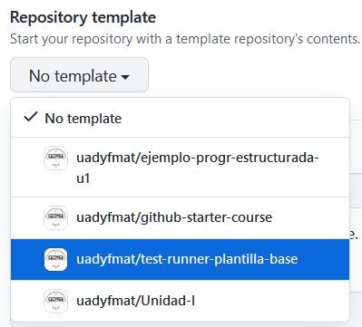
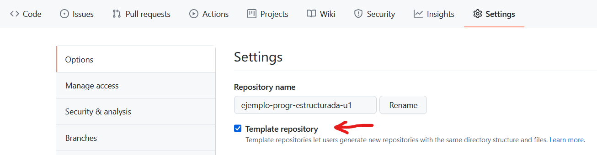
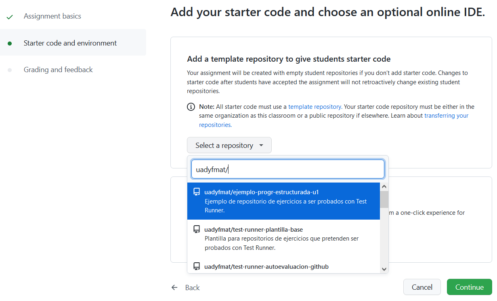
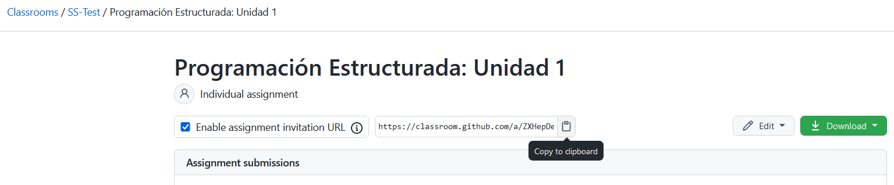
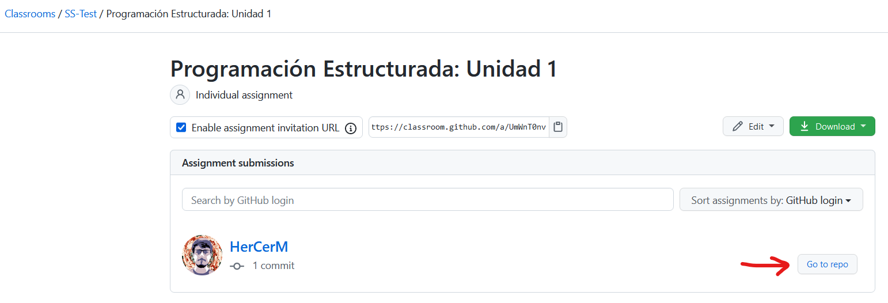
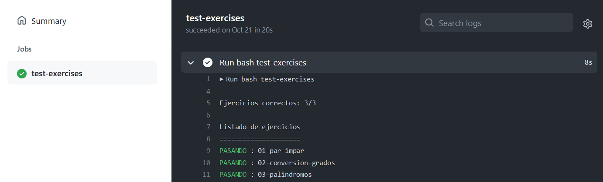

# Test Runner: Auto-evaluación con GitHub

[Test Runner](https://github.com/uadyfmat/test-runner) funciona en directorios con una estructura particular, donde cada uno de estos directorios representa un ejercicio de programación.

Para conseguir un **mecanismo de auto-evaluación**, se pretende que estos ejercicios se agrupen en repositorios de GitHub con un workflow de GitHub Actions ya configurado. Cada repositorio contiene varios ejercicios.

Aquí se describe lo que los alumnos, profesores y desarrolladores necesitan saber acerca de Test Runner respecto a los repositorios de ejercicios.

## Para alumnos

Para resolver los ejercicios de programación y poder obtener retroalimentación acerca de las soluciones, se require:

1. Instalar Test Runner y el software del que depende.
2. Usar Test Runner para probar las soluciones localmente.
3. Ver en GitHub la auto-evaluación del repositorio.

### 1. Instalación de Test Runner

Antes de utilizar Test Runner, es necesario realizar lo siguiente:

1. [Instala el software necesario para Test Runner](https://github.com/uadyfmat/test-runner#installation-and-usage).
2. [Instala los comandos necesarios para tu lenguaje de preferencia](https://github.com/uadyfmat/test-runner#supported-languages).
3. [Verifica que tu shell y terminal sean adecuados](https://github.com/uadyfmat/test-runner#shells-and-terminals).

**Acerca del punto 3 en Windows:** Teniendo Git Bash ya instalado, poder usarlo en Windows Terminal consiste en modificar un archivo de configuración:

1. Abre Windows Terminal.
2. Abre el archivo de configuración `settings.json`. Para conseguir esto, presiona <kbd>Ctrl+,</kbd>, luego en la barra lateral de la izquierda hasta abajo presiona el botón de abrir el archivo JSON.
3. En la propiedad `"list"` dentro de `"profiles"`, agrega el siguiente objeto como primer elemento del arreglo:

```text
{
    "commandline": "%PROGRAMFILES%/git/usr/bin/bash.exe -i -l",
    "guid": "{00000000-0000-0000-ba54-000000000002}",
    "icon": "%PROGRAMFILES%/Git/mingw64/share/git/git-for-windows.ico",
    "name": "Git Bash",
    "startingDirectory": "%USERPROFILE%"
}
```

Es posible que sea necesario modificar la ruta en `"commandline"` y `"icon"`, en caso que no se encuentren ahí el ejecutable o el ícono, aunque por defecto ahí se deberían encontrar.

<details>
<summary>Ejemplo de un <code>settings.json</code> completo.</summary>

```json
{
    "$schema": "https://aka.ms/terminal-profiles-schema",
    "actions":
    [
        {
            "command": 
            {
                "action": "copy",
                "singleLine": false
            },
            "keys": "ctrl+c"
        },
        {
            "command": "paste",
            "keys": "ctrl+v"
        },
        {
            "command": "find",
            "keys": "ctrl+shift+f"
        },
        {
            "command": 
            {
                "action": "splitPane",
                "split": "auto",
                "splitMode": "duplicate"
            },
            "keys": "alt+shift+d"
        }
    ],
    "copyFormatting": "none",
    "copyOnSelect": false,
    "defaultProfile": "{00000000-0000-0000-ba54-000000000002}",
    "profiles": 
    {
        "defaults": 
        {
            "closeOnExit": "always",
            "colorScheme": "deep",
            "fontFace": "Consolas"
        },
        "list":
        [
            {
                "commandline": "%PROGRAMFILES%/git/usr/bin/bash.exe -i -l",
                "guid": "{00000000-0000-0000-ba54-000000000002}",
                "icon": "%PROGRAMFILES%/Git/mingw64/share/git/git-for-windows.ico",
                "name": "Git Bash",
                "startingDirectory": "%USERPROFILE%"
            },
            {
                "commandline": "cmd.exe",
                "guid": "{0caa0dad-35be-5f56-a8ff-afceeeaa6101}",
                "hidden": false,
                "name": "S\u00edmbolo del sistema"
            },
            {
                "commandline": "powershell.exe",
                "guid": "{61c54bbd-c2c6-5271-96e7-009a87ff44bf}",
                "hidden": false,
                "name": "Windows PowerShell"
            }
        ]
    },
    "schemes": 
    [
        {
            "background": "#090909",
            "black": "#000000",
            "blue": "#5665FF",
            "brightBlack": "#535353",
            "brightBlue": "#9FA9FF",
            "brightCyan": "#8DF9FF",
            "brightGreen": "#22FF18",
            "brightPurple": "#E09AFF",
            "brightRed": "#FB0007",
            "brightWhite": "#FFFFFF",
            "brightYellow": "#FEDC2B",
            "cursorColor": "#D0D0D0",
            "cyan": "#50D2DA",
            "foreground": "#CDCDCD",
            "green": "#1CD915",
            "name": "deep",
            "purple": "#B052DA",
            "red": "#D70005",
            "selectionBackground": "#D2D2D2",
            "white": "#E0E0E0",
            "yellow": "#D9BD26"
        }
    ],
    "theme": "dark"
}
```

</details>

### 2. Uso de Test Runner

Teniendo el repositorio de ejercicio propio tras haber aceptado un assignment de GitHub Classroom, es necesario clonarlo con Git y abrirlo en algún editor de texto. Se sugiere [Visual Studio Code](https://code.visualstudio.com/).

Para correr el Test Runner sobre alguno de los ejercicios, correr el siguiente comando en una terminal abierta en el directorio del repositorio clonado:

```text
test-runner <nombre de la carpeta>
```

Por ejemplo: `test-runner 03-palindromos`

Cada directorio de ejercicio tiene la siguiente estructura:

```txt
03-palindromos
├── README.md           // Lo crea el profesor. Aquí se proporciona
|                       // una descripción acerca del ejercicio.
|
├── Solution.java,etc.  // Lo crea el alumno. Es la solución de
|                       // acuerdo a lo descrito en el README.md.
|
└── spec.inout          // Lo crea el profesor, por favor no modificar.
                        // Indica cuáles son los casos de prueba.
```

Para el archivo de solución puedes elegir entre alguno de [estos lenguajes](https://github.com/uadyfmat/test-runner#supported-languages).

Tras agregar una solución, Test Runner ya corre los casos de prueba del spec.inout y ofrecer retroalimentación acerca de cuáles pasan y cuáles no.

### 3. Auto-evaluación de los ejercicios en GitHub

Tras crear la solución para tus ejercicios y verificar con el Test Runner que son correctas, puedes subir cambios a GitHub donde se auto-evaluarán igualmente usando el Test Runner.

Para realizar esto, crea un commit con tus cambios y realiza push a la rama principal. En GitHub, al lado de tu último commit verás una palomita o tachita. Da click en ella, luego en "Details" y abre el apartado que lee `Run bash test-exercises`.

### Explicación en video

De ser necesario, se ofrece un video de explicación para alumnos: <https://youtu.be/e9aIrrjx3kA>

## Para profesores

Para aplicar ejercicios de programación a alumnos es necesario realizar lo siguiente:

1. Crear el repositorio de ejercicios.
2. Agregar los ejercicios al repositorio.
3. Crear el assignment en GitHub Classroom.
4. Compartir el assignment con los alumnos.
5. Al momento de evaluar, ver ejercicios correctos de cada alumno.

### 1. Crear el repositorio de ejercicios

El repositorio de ejercicios se crea como cualquier otro repositorio en GitHub, presionando el símbolo de **+** en la barra de navegación y eligiendo _nuevo repositorio_.

Lo importante es seleccionar [`uadyfmat/test-runner-plantilla-base`](https://github.com/uadyfmat/test-runner-plantilla-base) como plantilla del repositorio. Éste contiene el workflow de GitHub Actions que permite la auto-evaluación, ofrece una [plantilla para la descripción de los ejercicio](https://github.com/uadyfmat/test-runner-plantilla-base/blob/main/PLANTILLA_README.md) y un [ejemplo de archivo `spec.inout`](https://github.com/uadyfmat/test-runner-plantilla-base/blob/main/EJEMPLO_spec.inout).

<p align="center">
    
</p>

En adición que el repo es generado de una plantilla, éste igualmente **debe ser una plantilla**. Para conseguir esto último, diríjase a configuraciones y marque el checkbox de plantilla de su repo recién creado.

<p align="center">
    
</p>

### 2. Agregar ejercicios en el repositorio

Cada ejercicio corresponde a una carpeta nueva en el repositorio. Por lo tanto, agregar ejercicios consiste únicamente en agregar estas carpetas.

Para poder indicar un orden, el nombre de cada una de estas carpetas debe iniciar con dos números, por ejemplo `03-palindromos`. Dentro de cada una de las carpetas es importante colocar un README.md para que los alumnos sepan de qué trata el ejercicio, y un `spec.inout`, para que la herramienta Test Runner tenga casos de prueba contra los cuales probar la solución de los alumnos.

```txt
03-palindromos
├── README.md           // Lo crea el profesor. Aquí se proporciona
|                       // una descripción acerca del ejercicio.
|
└── spec.inout          // Lo crea el profesor. Indica cuáles son
                        // los casos de prueba del ejercicio.
```

- La estructura del `README.md` es libre, sin embargo se ofrece una [plantilla de guía](https://github.com/uadyfmat/test-runner-plantilla-base/blob/main/PLANTILLA_README.md).
- La estructura del `spec.inout` [está documentada](https://github.com/uadyfmat/test-runner#test-cases-file-specinout), igualmente se ofrece un [ejemplo de un `spec.inout` válido](https://github.com/uadyfmat/test-runner-plantilla-base/blob/main/EJEMPLO_spec.inout).

Para crear los directorios puede utilizar la interfaz gráfica de GitHub o bien clonar el repositorio y usar su editor de texto de preferencia. Todos los cambios se deben hacer sobre la rama principal: `main`.

Tras añadir los ejercicios, el repositorio se debe ver como el ejemplo [`uadyfmat/ejemplo-progr-estructurada-u1`](https://github.com/uadyfmat/ejemplo-progr-estructurada-u1). Es correcto que el workflow esté fallando, tras que el alumno añada sus soluciones debe pasar.

### 3. Crear el assignment en GitHub Classroom

Al presionar el botón de crear assignment en su GitHub Classroom, se inicia el proceso de creación, el cual consta de 3 vistas.

En la primera vista sólo es necesario colocar el título del assignment.

En la segunda vista es necesario indicar la plantilla del assignment. Se selecciona el repositorio con los ejercicios.

<p align="center">
    
</p>

En la última vista sólo se presiona el botón de crear el assignment.

### 4. Compartir el assignment con los alumnos

Para compartir el assignment basta con compartir el URL de invitación del mismo. En el classroom, diríjase al assignment creado, copie el URL y distribúyalo por el medio que considere más conveniente.

<p align="center">
    
</p>

### 5. Ver ejercicios correctos por alumno

Para revisar qué ejercicios tiene correctos los alumnos, actualmente es necesario entrar al repositorio de cada alumno, uno por uno.

<p align="center">
    
</p>

Una vez en el repositorio de un alumno, en la pestaña "Actions" en "Run bash test-exercises" se puede consultar la información de la última auto-evaluación.

<p align="center">
    
</p>


### Explicación en video

De ser necesario, se ofrece un video de explicación para profesores: <https://youtu.be/clPdSuhGwM4>

## Para desarrolladores

### Proyecto Test Runner

Repositorio de Test Runner, incluyendo código y documentación: <https://github.com/uadyfmat/test-runner>

### Workflows

Los workflows son procesos automatizados configurables formados por uno o más trabajos.  
Estos archivos trabajan bajo la sintaxis YAML, es por ello que debe de tener una extensión de archivo `.yml` o `.yaml`.  
Cada uno de estos flujos de trabajo deben de guardarse en el directorio `.github/workflow`.

Para poder ver el contenido de este archivo, puedes dar click en el siguiente [enlace](https://github.com/uadyfmat/test-runner-plantilla-base/blob/main/.github/workflows/default.yml).

En pocas palabras este workflow esta constitudo de 3 secciones:

- El nombre del workflow,
- Un apartado en el cual se especifica en que momento se llevará acabo dicho workflow.
- Los `jobs`
  - El cual se encarga de montar nuestro entorno virtual, el cual puede ser linux, mac o windows.
  - En este apartado igual se pueden definir cada uno de los pasos que se llevarán acabo.

Como podemos observar este workflow tiene unos steps fundamentales, los cuales nos ayudarán a llevar a cabo este trabajo de automatización.  
En primera instancia como estaremos trabajando con distintas paqueterias de Node, tenemos que montar en nuestro entorno virtual todo el setup de node, en el cual podemos especificar una version para utilizar y asi instalar lo necesario.
Por otro lado tenemos los `steps` los cuales son pieza fundamental en esto ya que para este trabajo, necesitamos instalar una paquetería de node, la cual fue desarrollada por alumnos de la Universidad Autónoma de Yucatán, para luego correr un archivo `bash` que nos ayuda a ir ejecutando cada una de las soluciones a los ejercicios creados en este repositorio.


### Carpetas de ejercicios

Como mencionamos anteriormente este template consta de una serie de ejercicios los cuales deben de cumplir características específicas. Principalmente para que el sistema reconozca que es un ejercicio, la carpeta debe de tener un prefijo, el cual tenemos definido como `E-`, esta característica es fundamental ya que el archivo `test-exercises.sh` detectará dichos ejercicios, los analizará con el paquete [test-runner](https://github.com/uadyfmat/test-runner) y nos dará un resultado de dicha solución.

Una vez concluido con el elemento anterior podemos fijarnos en el contenido de dichas carpetas, estas deben de contener lo siguiente:

```txt
.
└── E-EntreLimites
    ├── README.md (optional)
    ├── Solution.java
    └── spec.inout
```

Como podemos ver los ejercicios deben contener 3 archivos, de los cuales 2 son muy necesarios, el `spec.inout` es en donde el profesor tendrá que definir las entradas y salidas para dicho ejercicio.

Para más información, consulta [archivo spec.inout](https://github.com/uadyfmat/test-runner#test-cases-file-specinout).

El archivo `Solution.extension`, el cual el alumno será el encargado de crear dicho archivo.

Finalmente esta en el archivo `Readme.md` en donde el maestro podrá hablar un poco sobre las caracteristicas del ejercicio, datos de entrada y datos de salida.

### `Package.json` y `test-exercises.sh`

Para ir concluyendo hablaremos de los últimos archivos que constituyen este template de ejercicios.

Primero hablaremos de los archivos `package.json` y `package-lock.json` estos archivos son de estilo dummy
para que el workflow pueda llevar a cabo la instalación de la paqueteria de node.

Por último tenemos el archivo [test-exercises](./resources/test-exercises)

El cual es el encargado de ir guardando los resultados de los ejercicios e unos archivos temporales en el entorno de linux que montamos para asi verificar las salidas de los programas.
